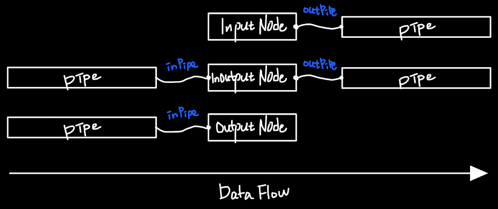

# 📔 노드 개발 가이드

<br>

## 📄 샘플 노드 보기
- 샘플 노드 ([https://github.com/jeongyongs/xflow/tree/sample/src/test/java/com/nhnacademy/aiot/sample](https://github.com/jeongyongs/xflow/tree/sample/src/test/java/com/nhnacademy/aiot/sample))
<br>

## 🛠️ 노드별 개발 방법
### ⏹️➡️ 입력 노드(InputNode)
1. `InputNode` 인터페이스를 `implements`합니다.
   ```java
   public class MyInputNode implements InputNode { ... }
   ```
2. 노드가 스레드로 동작할 수 있도록 `start()`와 `stop()`을 구현합니다.
   ```java
   @Override
   public void start() {
       // 노드 스레드를 실행하는 구현부
   }
   
   @Override
   public void stop() {
       // 노드 스레드를 중지하는 구현부
   }
   ```
3. 노드가 메세지를 담을 파이프와 연결할 수 있도록 `connectOut(int, Pipe)`을 구현합니다.
   ```java
   @Override
   public void connectOut(int port, Pipe outPipe) {
       // 메세지를 담을 파이프와 연결하는 구현부
   }
   ```
4. 노드가 동작하도록 `run()`을 구현합니다.
   ```java
   @Override
   public void run() {
       // 노드의 동작 로직 구현
   }
   ```
<br>

### ➡️⏹️ 출력 노드(OutputNode)
1. `OutputNode` 인터페이스를 `implements`합니다.
   ```java
   public class MyOutputNode implements OutputNode { ... }
   ```
2. 노드가 스레드로 동작할 수 있도록 `start()`와 `stop()`을 구현합니다.
   ```java
   @Override
   public void start() {
       // 노드 스레드를 실행하는 구현부
   }
   
   @Override
   public void stop() {
       // 노드 스레드를 중지하는 구현부
   }
   ```
3. 노드가 메세지를 가져올 파이프와 연결할 수 있도록 `connectIn(int, Pipe)`을 구현합니다.
   ```java
   @Override
   public void connectIn(int port, Pipe inPipe) {
       // 메세지를 가져올 파이프와 연결하는 구현부
   }
   ```
4. 노드가 동작하도록 `run()`을 구현합니다.
   ```java
   @Override
   public void run() {
       // 노드의 동작 로직 구현
   }
   ```
<br>

### ➡️⏹️➡️ 입출력 노드(InOutputNode)
1. `InputNode`와 `OutputNode` 인터페이스를 `implements`합니다.
   ```java
   public class MyInOutputNode implements InputNode, OutputNode { ... }
   ```
2. 노드가 스레드로 동작할 수 있도록 `start()`와 `stop()`을 구현합니다.
   ```java
   @Override
   public void start() {
       // 노드 스레드를 실행하는 구현부
   }
   
   @Override
   public void stop() {
       // 노드 스레드를 중지하는 구현부
   }
   ```
3. 노드가 메세지를 담을 파이프와 연결할 수 있도록 `connectOut(int, Pipe)`을 구현합니다.
   ```java
   @Override
   public void connectOut(int port, Pipe outPipe) {
       // 메세지를 담을 파이프와 연결하는 구현부
   }
   ```
4. 노드가 메세지를 가져올 파이프와 연결할 수 있도록 `connectIn(int, Pipe)`을 구현합니다.
   ```java
   @Override
   public void connectIn(int port, Pipe inPipe) {
       // 메세지를 가져올 파이프와 연결하는 구현부
   }
   ```
5. 노드가 동작하도록 `run()`을 구현합니다.
   ```java
   @Override
   public void run() {
       // 노드의 동작 로직 구현
   }
   ```